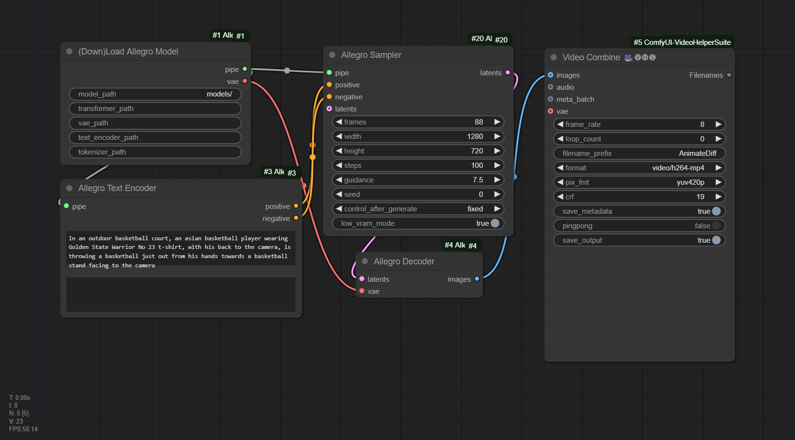
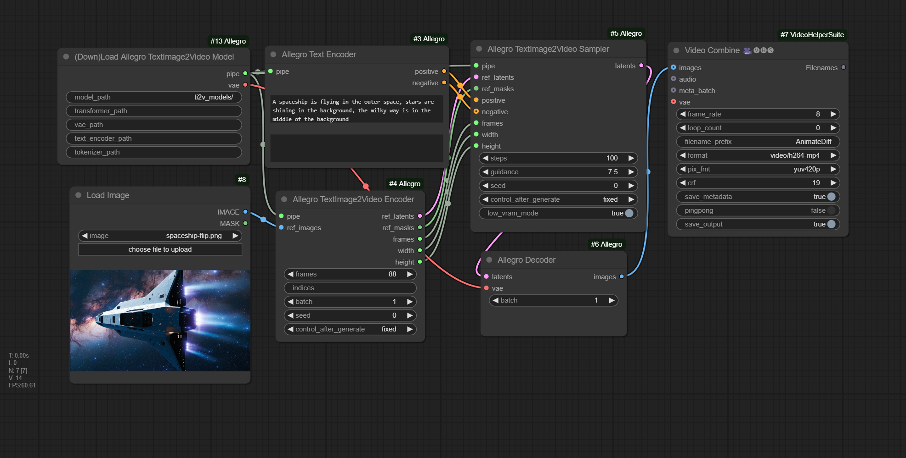

## ComfyUI-Allegro
ComfyUI supports over rhymes-ai/Allegro, which uses text prompt to generate short video in relatively high quality, especially comparing to other open source solutions available for now.

## News 🔥
- [25/1/14] Added supports on Image-to-Video models (Text Image to Video in Allegro term)

## Installation

_Assuming that you are under your ComfyUI root directory_
```
git clone https://github.com/bombax-xiaoice/ComfyUI-Allegro custom_nodes/ComfyUI-Allegro

pip install -r custom_nodes/ComfyUI-Allegro/requirements.txt
```
_You can download the model file from huggingface or its mirror site beforehand, or just wait for the first run of (Down)Load Allegro Model or (Down)Load Allegro TextImage2Video Model to download it_

```
git lfs clone https://huggingface.co/rhymes-ai/Allegro custom_nodes/ComfyUI-Allegro/models

git lfs clone https://huggingface.co/rhymes-ai/Allegro-TI2V custom_nodes/ComfyUI-Allegro/ti2v_models
```

_Alternatively, if local disk space or download time is a concern, download the transformer from Allegro-TI2V only, then share other folders with Allegro_

```
mkdir -p ti2v_models/transformer/

wget https://huggingface.co/rhymes-ai/Allegro-TI2V/resolve/main/transformer/config.json -O ti2v_models/transformer/config.json

wget https://huggingface.co/rhymes-ai/Allegro-TI2V/resolve/main/transformer/diffusion_pytorch_model.safetensors -O ti2v_models/transformer/diffusion_pytorch_model.safetensors

ln -s custom_nodes/ComfyUI-Allegro/models/vae custom_nodes/ComfyUI-Allegro/ti2v_models/vae

ln -s custom_nodes/ComfyUI-Allegro/models/text_encoder custom_nodes/ComfyUI-Allegro/ti2v_models/text_encoder

ln -s custom_nodes/ComfyUI-Allegro/models/tokenizer custom_nodes/ComfyUI-Allegro/ti2v_models/tokenizer

ln -s custom_nodes/ComfyUI-Allegro/models/scheduler custom_nodes/ComfyUI-Allegro/ti2v_models/scheduler
```

## Example Workflow
Drag the following image into comfyui, or click Load for custom_nodes/ComfyUI-Allegro/allegro-comfy-example.json



Results run under comfy

https://github.com/user-attachments/assets/75f90597-7e33-4076-b00f-7ed5d88ea22b

## Example TextImage2Video Workflow
Drag the following image into comfyui, or click Load for custom_nodes/ComfyUI-Allegro/allegro-ti2v-comfy-example.json



## Tips
1. Only verified that frame=88,width=1280,height=720 is working. Tried 24 frames and the result looks like random mosaics. Also tried width=560, where noisy bars show up along both left and right edges.

2. In (Down)Load Allegro Model, only provide the model path and leave others blank, unless you want to use alternative text encoder or vae models not provided by https://huggingface.co/rhymes-ai/Allegro

3. A default negative prompt will be used if you leave it blank in Allegro Text Encoder. A static template will also apply to the positive prompt.

4. Can skip Allegro Sampler's input latents to use frames/width/height to initialize it randomly. Otherwise, the batch size of input latents must be set as 1/4 of the desirable frames count.

5. Verified to work on a single NVidia RTX 3070 card with 8G graphics memory, where __low_vram_mode__ is turned on to load 32 layers of unet transformer block one by one into gpu vram, VAE decoder is also loaded seperately, and text encoder fall over to cpu. 

6. If you have enough graphics memory. You can try use --highvram on comfy start, where the entire pipeline is loaded into GPU directly to spare unnecessary conversion between CPU and GPU.

7. It is recommend to choose a preview method (inside comfy Manager), so that you can see intermediate result of each step during the long run.

8. In TextImage2Video mode, `ref_images`, as an required input to Allegro TextImage2Video Encoder, can be one reference image (starting frame), two reference images (starting and ending frame) or multiple reference images (frame interpolation). Then pass both `ref_latents` and `ref_masks` to Allegro TextImage2Video Sampler.

9. May use `WAS-Suite`'s `Image Batch` to put reference images together. 

10. The optional `indices` parameter further customizes image-to-frame mapping, e.g. `0,10,-1` map the first image to frame 0, the second image to frame 10, and the third image to the last frame.

11. Regarding the `batch` parameter in Encoder or Decoder, setting higher value may increase its speed at the risk of GPU OOM.